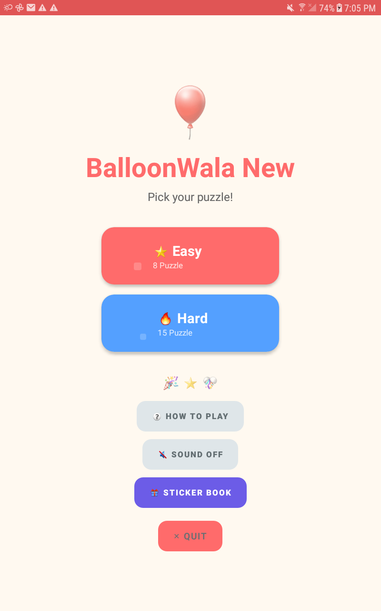
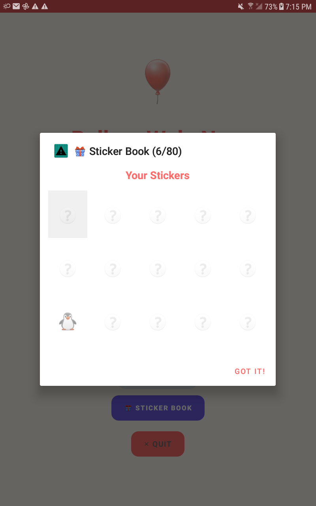
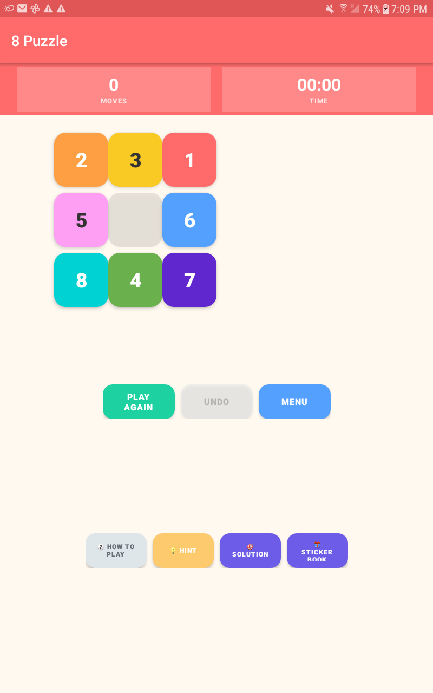
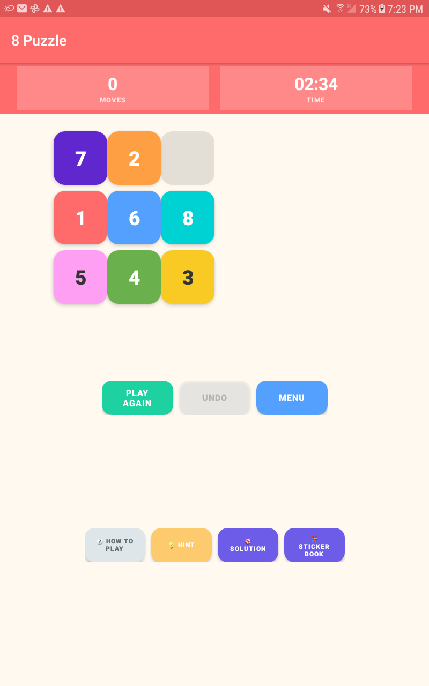
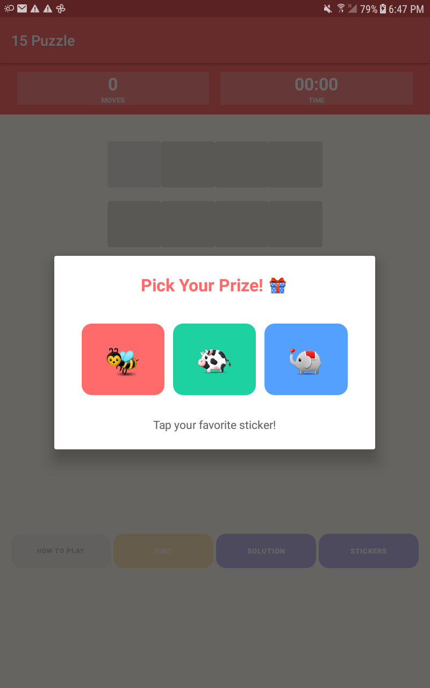

# 🎈 BalloonWala

A colourful sliding-tile puzzle game for kids aged 5 and up, built as a native Android app in Java.

Choose between the classic **8-puzzle** (3×3 grid) or the more challenging **15-puzzle** (4×4 grid). 
Slide the numbered tiles into the correct order to win — then enjoy the balloon shower celebration!

---

## 📸 Screenshots

| Home Screen | Puzzle Gameplay | Sticker Book |
|:---:|:---:|:---:|
|  |  |  |

| Hint System | Victory Pop! | Pick Your Prize |
|:---:|:---:|:---:|
|  |  |  |

---

## Features

**Gameplay**
- Two puzzle modes — 8-puzzle (Easy ⭐) and 15-puzzle (Hard 🔥)
- Every generated puzzle is mathematically guaranteed to be solvable
- Live move counter and timer during play
- Undo — step back through your moves one at a time
- Best score and best time saved between sessions
- **State Persistence** — survives screen rotations and app backgrounding without losing progress
- **View Board** — Optional "View Board" mode after winning to appreciate the solved puzzle

**Interactive Rewards (New! 🎁)**
- **Sticker Book** — Earn over 80 unique animal and space emojis displayed in a large, kid-friendly grid.
- **Pick Your Prize** — Solve a puzzle without hints to choose 1 of 3 colorful mystery stickers.
- **Interactive Celebration** — Tap the floating victory balloons to pop them with a satisfying sound!

**Kid-Friendly Accessibility**
- **Voice Guidance** — App reads "How to Play" rules and win messages aloud (Text-to-Speech).
- **Haptic Feedback** — Subtle tactile vibration ("tick") on every tile move for a physical feel.
- **How to Play** — Dedicated in-game guide with clear, simple instructions for kids.

**Hint System**
- 💡 Hint button — solver finds the optimal next move and shows it with:
  - A pulsing scale animation on the correct tile
  - An amber glow on the empty slot
  - A custom-drawn canvas arrow from tile center to empty slot center
- 🎯 Solution button — watch the full optimal solution auto-played step by step

**Sound**
- Tile tap and Balloon "Pop" sounds (low-latency programmatic sine waves)
- Win fanfare melody — C–E–G–C ascending notes
- Optional background music (add `res/raw/background_music.ogg`)
- Sound on/off toggle on the home screen, persisted between sessions

---

## Project Structure

```
com.example.balloonwala/
│
├── assets/                    Project assets (screenshots, etc.)
│   └── screenshots/           App preview images
│
├── AppConstants.java          Puzzle mode sizes + SharedPreferences name
├── NavigationConstants.java   Intent extra keys for screen navigation
├── BalloonWalaApp.java        Application singleton — Helper lifecycle management
│
├── MainActivity.java          Home screen — mode selection + Sticker Book
├── SplashActivity.java        Splash screen
├── PuzzleActivity.java        Game screen — orchestrates gameplay + state restoration
│
├── helpers/
│   ├── AnimationHelper.java   Smooth tile slide animations
│   ├── ButtonManager.java     Tile button registry and touch handling
│   ├── ButtonStyleHelper.java Programmatic Material button styling
│   ├── CelebrationHelper.java Interactive balloon shower + win overlay
│   ├── GameState.java         Move counter + undo stack history
│   ├── GameTimer.java         Chronometer wrapper — survives rotations
│   ├── HintHelper.java        Pulse + glow + canvas arrow hint
│   ├── SolutionHelper.java    Auto-plays solution step by step
│   ├── SoundHelper.java       Sine-wave sounds + cached PCM buffers
│   ├── SpeechHelper.java      Text-to-Speech management
│   ├── StickerHelper.java     Reward system + sticker persistence
│   ├── TileStyleHelper.java   Fixed color per tile number (pre-parsed)
│   └── UIHelper.java          Common dialogs + Sticker gallery UI
│
├── solver/
│   └── PuzzleSolver.java      Optimized IDA* with Linear Conflict heuristic
│
├── utils/
│   └── GenericUtils.java      Tile operations + solvability checks
│
└── views/
    └── HintArrowView.java     Custom Canvas view — draws the hint arrow
```

---

## Solver

The hint and solution features use an **Optimized IDA\* (Iterative Deepening A\*)** search.

- **Manhattan Distance + Linear Conflict** — Advanced heuristics ensure the solver is up to 100x faster than basic A*.
- **Zero-Allocation Search** — In-place array manipulation prevents Garbage Collection pauses.
- **Admissible** — Always guarantees the **optimal** (fewest moves) solution.
- **Incremental Updates** — Heuristic values are updated in O(1) time per move for maximum speed.

---

## Setup

### Prerequisites
- Android Studio (latest stable)
- Android SDK API 26+
- Java 8+

### Required manifest change
Ensure the `<application>` tag in `AndroidManifest.xml` includes:
```xml
android:name=".BalloonWalaApp"
```

---

## What's Persisted

All data is stored in `SharedPreferences`:

| Key | What |
|---|---|
| `best_moves_...` | Personal records (unassisted wins only) |
| `best_time_...` | Best completion time (unassisted wins only) |
| `unlocked_stickers` | Set of strings representing earned emoji stickers |
| `sound_enabled` | Player sound preference |

---

*Made with ❤️ as a gift for the kids.*
